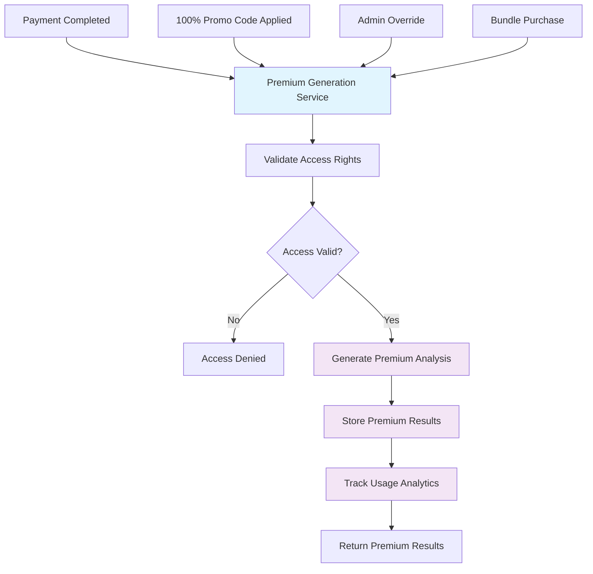

# 🚨 **Critical Architecture Fix: Unified Premium Generation**

## 🎯 **Issue Identified**

### **Problem**: Duplicate Premium Generation Logic
During the documentation review, a critical architectural flaw was identified:

- **Premium Payment Flow**: `Generate Premium Analysis` (Line 48)
- **Promotional Codes Flow**: `Generate Premium Results` (Lines 86, 88)
- **Bundle Flow**: Likely has similar duplication

### **Impact**: 
- ❌ **Code Duplication**: Violates DRY principle
- ❌ **Maintenance Nightmare**: Changes need to be made in multiple places
- ❌ **Inconsistent Behavior**: Different flows may behave differently
- ❌ **Testing Complexity**: Need to test multiple implementations
- ❌ **Bug Risk**: Fixes in one flow may not be applied to others

---

## ✅ **Solution: Unified Premium Generation Service**

### **Architecture**: Single Source of Truth

### **Benefits**:
- ✅ **Single Method**: One `generate_premium_results()` method
- ✅ **Consistent Logic**: Same generation logic regardless of trigger
- ✅ **Maintainable**: Changes in one place affect all flows
- ✅ **Testable**: Single service to test comprehensively
- ✅ **Extensible**: Easy to add new access types

---

## 🚀 **Implementation Plan**

### **Phase 1: Core Service Creation (Week 1)**
- Create `PremiumGenerationService`
- Implement `AccessValidator`
- Add comprehensive error handling
- Create unit tests

### **Phase 2: Update Existing Flows (Week 2)**
- Update payment flow to use unified service
- Update promotional codes flow to use unified service
- Update bundle flow to use unified service
- Remove duplicate generation logic

### **Phase 3: Testing & Validation (Week 3)**
- Create comprehensive test suite
- Test all access types
- Validate consistency across flows
- Performance testing

### **Phase 4: Migration & Deployment (Week 4)**
- Database migration for access tracking
- Gradual migration with feature flags
- A/B testing with small user percentage
- Full deployment after validation

---

## 📊 **Success Metrics**

### **Code Quality**
- **Duplication Reduction**: 100% elimination of duplicate premium generation logic
- **Test Coverage**: 100% coverage for unified service
- **Maintainability**: Single point of change for premium generation

### **Performance**
- **Response Time**: < 2 seconds for premium generation
- **Error Rate**: < 0.1% for premium generation
- **Consistency**: 100% consistent results across access types

### **Business**
- **User Experience**: Consistent premium experience regardless of access method
- **Analytics**: Unified tracking of all premium access methods
- **Scalability**: Easy addition of new access types

---

## 🔗 **Documentation Created**

### **Architecture Documentation**
- **[Unified Premium Generation Architecture](architecture/UNIFIED_PREMIUM_GENERATION.md)**
- **[Unified Premium Implementation Plan](implementation/UNIFIED_PREMIUM_IMPLEMENTATION.md)**

### **Updated Flow Diagrams**
- **[Premium Payment Flow](features/premium-payment.md)** - Updated to use unified service
- **[Promotional Codes Flow](features/promotional-codes.md)** - Updated to use unified service

### **Implementation Details**
- **Service Design**: Complete service architecture with access validation
- **API Updates**: Updated API endpoints to use unified service
- **Database Schema**: Migration plan for access tracking
- **Testing Strategy**: Comprehensive test coverage plan

---

## 🎯 **Next Steps**

### **Immediate Actions**
1. **Review Architecture**: Review the unified architecture design
2. **Approve Implementation**: Approve the 4-week implementation plan
3. **Assign Resources**: Assign developers to implement the unified service
4. **Create Tasks**: Break down implementation into specific tasks

### **Development Priority**
This should be **HIGH PRIORITY** as it:
- Fixes a critical architectural flaw
- Prevents future maintenance issues
- Ensures consistent user experience
- Simplifies testing and deployment

---

## 💡 **Key Takeaway**

**"This is exactly the kind of architectural issue that can cause major problems down the line. By identifying and fixing this duplication now, we prevent:**
- **Inconsistent behavior** between different access methods
- **Maintenance nightmares** when making changes
- **Testing complexity** with multiple implementations
- **Bug risks** from incomplete fixes

**The unified architecture ensures we have a single, reliable, maintainable solution for premium generation regardless of how the user accesses it."**

---

**Status**: ✅ **Architecture Designed** | 🔄 **Ready for Implementation** | 📋 **Implementation Plan Created**
