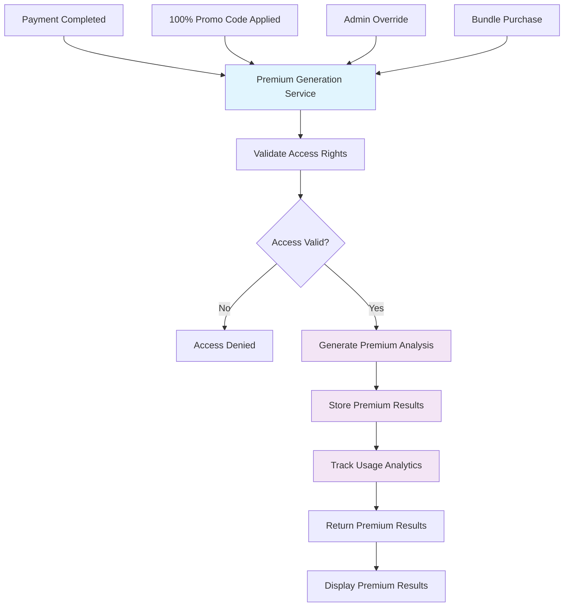
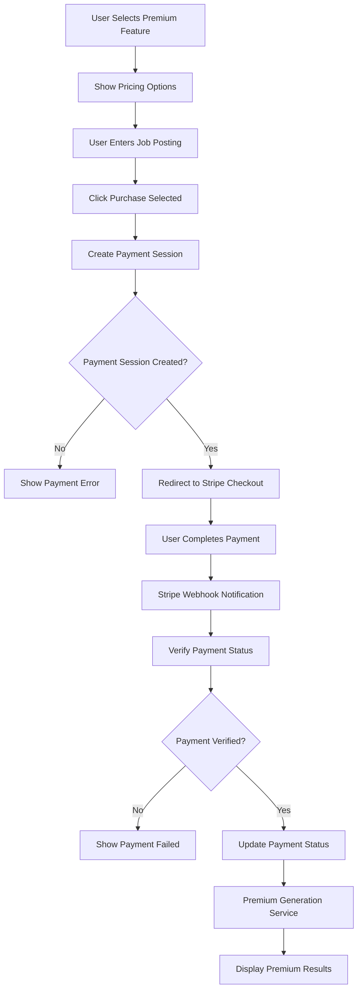
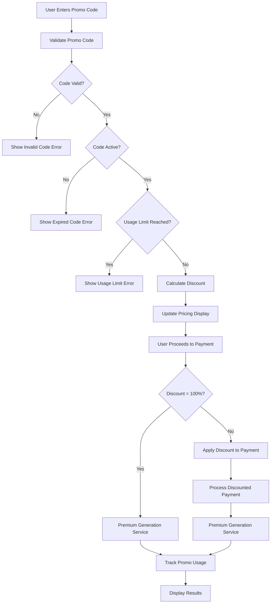

# 🏗️ **Unified Premium Generation Architecture**

## 🚨 **Critical Issue Identified**

### **Problem**: Duplicate Premium Generation Logic
- **Premium Payment Flow**: `Generate Premium Analysis` (Line 48)
- **Promotional Codes Flow**: `Generate Premium Results` (Lines 86, 88)
- **Violation**: DRY (Don't Repeat Yourself) principle
- **Impact**: Code duplication, maintenance nightmare, inconsistent behavior

---

## 🎯 **Solution: Unified Premium Generation Service**

### **Core Principle**: Single Source of Truth
- **One Service**: `PremiumGenerationService`
- **One Method**: `generate_premium_results()`
- **Multiple Triggers**: Payment completion, 100% promo code, admin override
- **Consistent Output**: Same premium results regardless of trigger

---

## 🔄 **Unified Flow Architecture**



---

## 🏗️ **Service Architecture**

### **PremiumGenerationService**
```python
class PremiumGenerationService:
    def __init__(self):
        self.analysis_service = AnalysisService()
        self.database_service = DatabaseService()
        self.analytics_service = AnalyticsService()
    
    def generate_premium_results(
        self, 
        analysis_id: str, 
        access_type: AccessType,
        access_context: dict
    ) -> PremiumResult:
        """
        Unified method for generating premium results
        
        Args:
            analysis_id: ID of the analysis
            access_type: PAYMENT, PROMO_CODE, ADMIN_OVERRIDE, BUNDLE
            access_context: Additional context (promo_code, payment_id, etc.)
        
        Returns:
            PremiumResult: Generated premium analysis
        """
        # 1. Validate access rights
        if not self._validate_access(analysis_id, access_type, access_context):
            raise AccessDeniedError("Invalid access to premium results")
        
        # 2. Generate premium analysis (SINGLE METHOD)
        premium_result = self.analysis_service.generate_premium_analysis(
            analysis_id=analysis_id,
            access_type=access_type,
            context=access_context
        )
        
        # 3. Store results (SINGLE METHOD)
        self.database_service.store_premium_results(
            analysis_id=analysis_id,
            premium_result=premium_result,
            access_type=access_type,
            access_context=access_context
        )
        
        # 4. Track analytics (SINGLE METHOD)
        self.analytics_service.track_premium_generation(
            analysis_id=analysis_id,
            access_type=access_type,
            access_context=access_context
        )
        
        return premium_result
```

---

## 🔄 **Updated Flow Diagrams**

### **Premium Payment Flow (Updated)**


### **Promotional Codes Flow (Updated)**


---

## 🎯 **Benefits of Unified Architecture**

### **✅ Code Reuse**
- **Single Method**: One `generate_premium_results()` method
- **Consistent Logic**: Same generation logic regardless of trigger
- **Maintainable**: Changes in one place affect all flows

### **✅ Consistency**
- **Same Output**: Identical premium results for all access types
- **Same Validation**: Consistent access validation
- **Same Analytics**: Unified tracking and analytics

### **✅ Extensibility**
- **Easy Addition**: New access types (gift codes, subscriptions, etc.)
- **Plugin Architecture**: Easy to add new generation methods
- **Configuration**: Access type-specific configurations

### **✅ Testing**
- **Single Test Suite**: Test one service instead of multiple flows
- **Comprehensive Coverage**: Test all access types with same tests
- **Mocking**: Easy to mock single service for testing

---

## 🧪 **Implementation Strategy**

### **Phase 1: Create Unified Service**
1. Create `PremiumGenerationService`
2. Implement `generate_premium_results()` method
3. Add access type validation
4. Add analytics tracking

### **Phase 2: Update Existing Flows**
1. Update payment flow to use unified service
2. Update promotional codes flow to use unified service
3. Update bundle flow to use unified service
4. Remove duplicate generation logic

### **Phase 3: Testing & Validation**
1. Create comprehensive test suite
2. Test all access types
3. Validate consistency across flows
4. Performance testing

---

## 🔗 **Related Documentation**
- **Implementation**: [Unified Service Implementation](../services/premium-generation-service.md)
- **Tests**: [Unified Service Tests](../tests/premium-generation-tests.md)
- **API**: [Unified Premium API](../api/premium-generation-api.md)
- **Migration**: [Migration Plan](../migration/unified-premium-migration.md)
