# 🎨 **Resume Health Checker v4.0 - Diagram Viewer**

## 🎯 **Interactive Diagram Navigation**

This page provides direct access to all Mermaid diagrams with live rendering. Click on any diagram to view it in full detail.

---

## 🔄 **Flow Diagrams**

### **Flow 1: Free Resume Analysis**
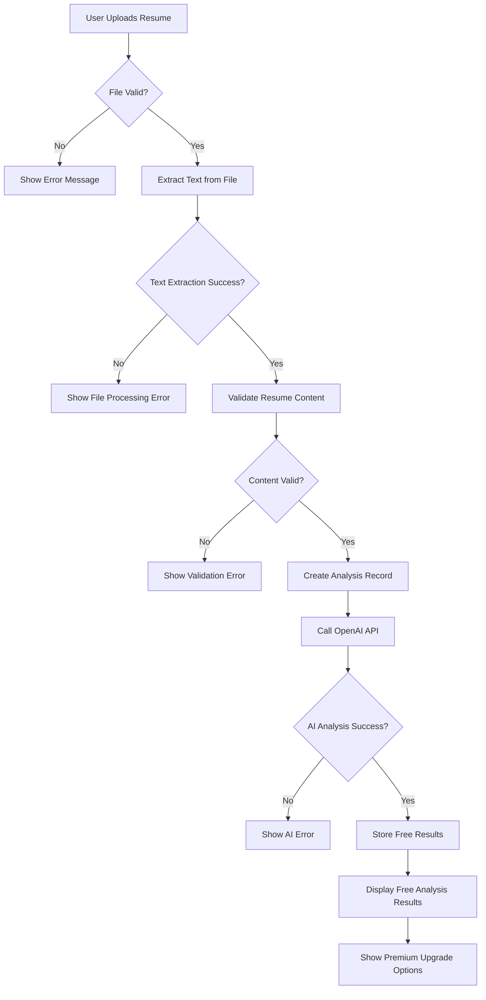

### **Flow 2: Premium Payment & Results**
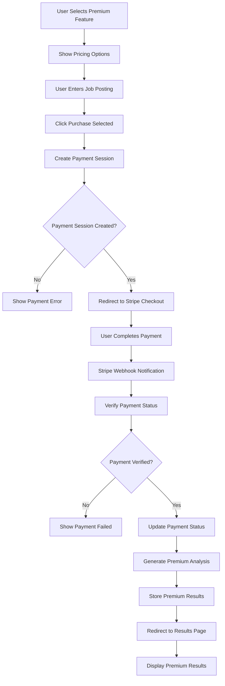

### **Flow 3: Bundle Purchase & Delivery**
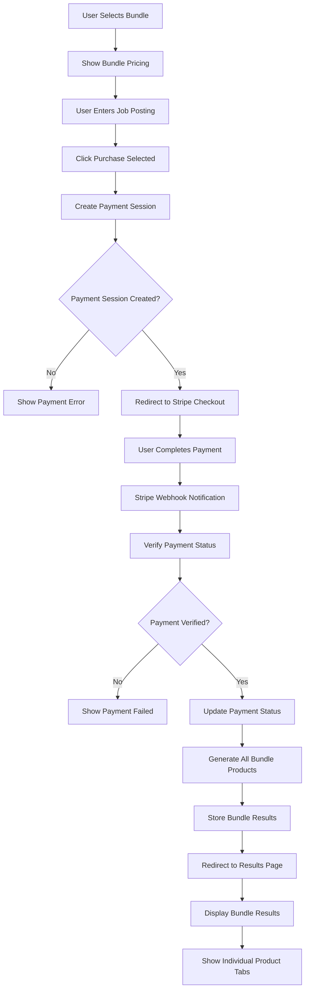

### **Flow 4: Promotional Code Application**
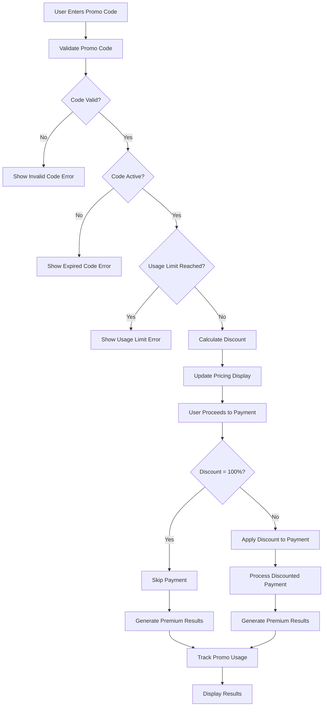

---

## 🔄 **Sequence Diagrams**

### **Free Resume Analysis Sequence**
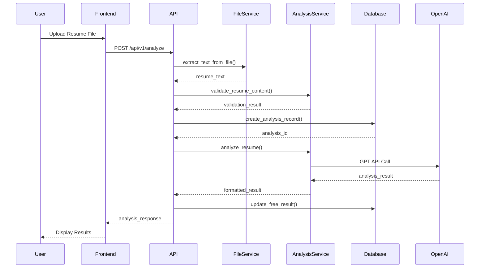

### **Premium Payment Sequence**
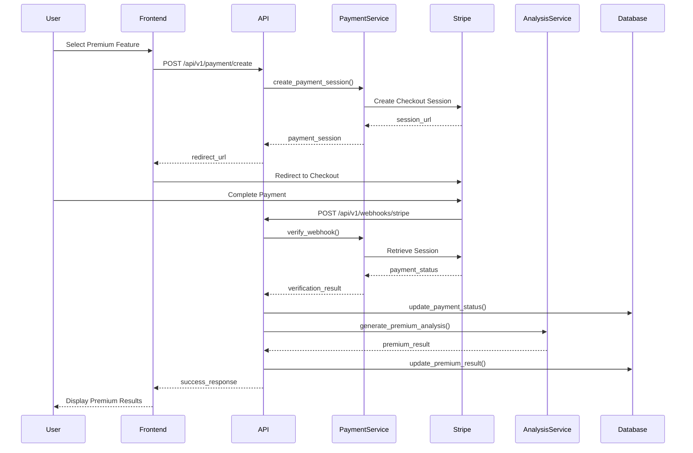

### **Promotional Code Sequence**
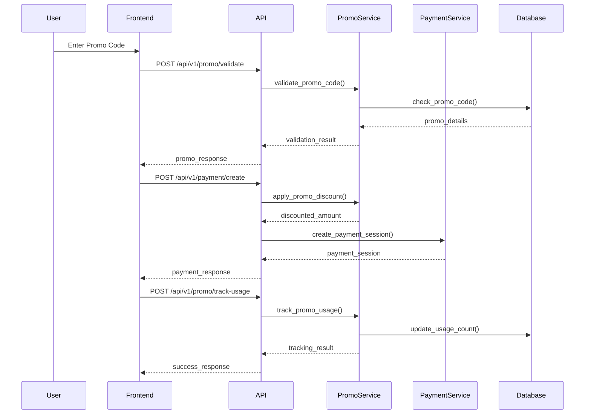

---

## 🗄️ **Schema Diagrams**

### **Core Database Schema**
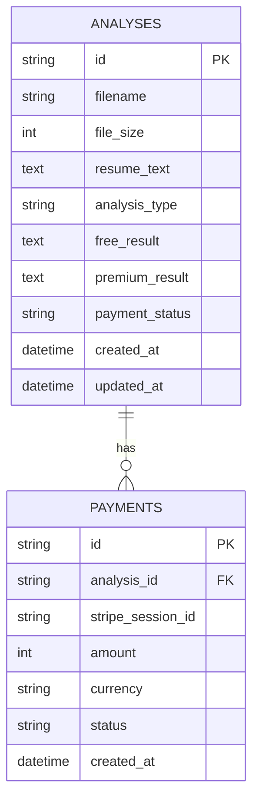

### **Promotional Code Schema**
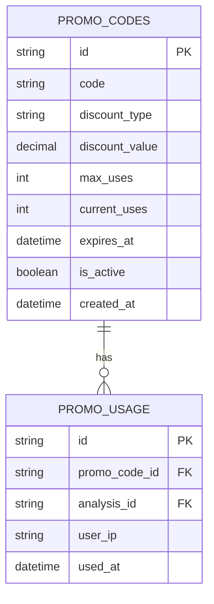

---

## 🏗️ **Architectural Diagrams**

### **System Architecture**
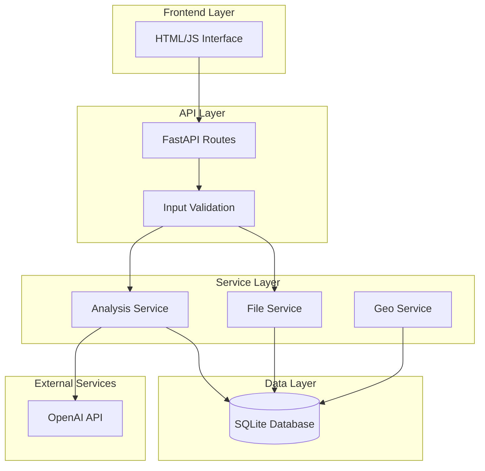

### **Security Architecture**
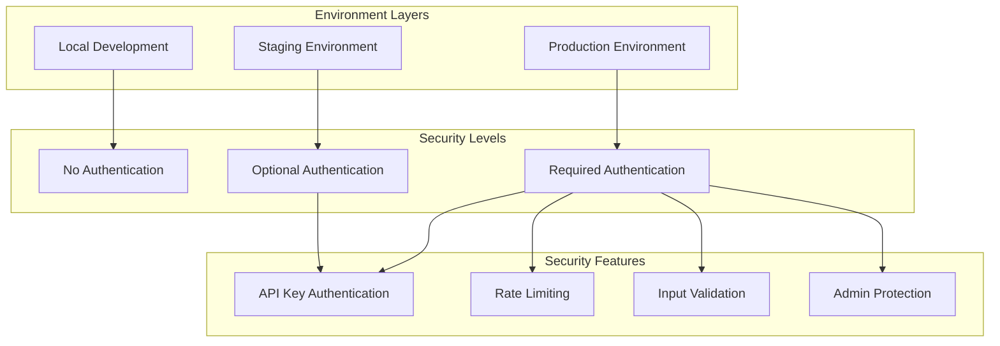

---

## 📊 **Sprint Planning Diagrams**

### **Sprint 1: Foundation & Security**
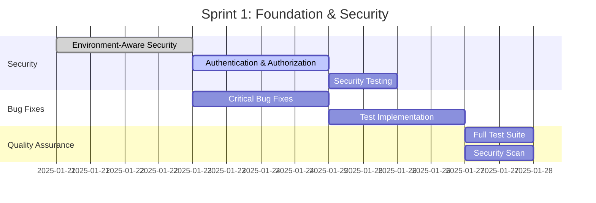

### **Sprint 2: Feature Development**
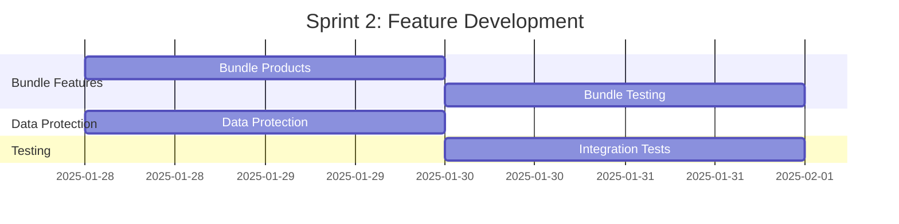

---

## 🧪 **Test Coverage Diagrams**

### **Test Coverage Matrix**
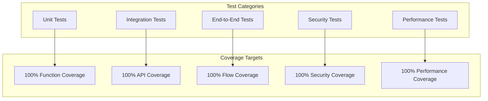

---

## 🎯 **Quick Diagram Access**

### **By Feature**
- **Free Analysis**: [Flow 1](#flow-1-free-resume-analysis) | [Sequence 1](#free-resume-analysis-sequence)
- **Premium Payment**: [Flow 2](#flow-2-premium-payment--results) | [Sequence 2](#premium-payment-sequence)
- **Bundle Purchase**: [Flow 3](#flow-3-bundle-purchase--delivery)
- **Promotional Codes**: [Flow 4](#flow-4-promotional-code-application) | [Sequence 3](#promotional-code-sequence)

### **By Type**
- **Flow Diagrams**: [All Flows](#flow-diagrams)
- **Sequence Diagrams**: [All Sequences](#sequence-diagrams)
- **Schema Diagrams**: [All Schemas](#schema-diagrams)
- **Architectural Diagrams**: [All Architectures](#architectural-diagrams)

### **By Sprint**
- **Sprint 1**: [Sprint 1 Gantt](#sprint-1-foundation--security)
- **Sprint 2**: [Sprint 2 Gantt](#sprint-2-feature-development)

---

## 📱 **Mobile-Friendly Viewing**

### **Diagram Viewing Tips**
- **Zoom**: Use browser zoom (Ctrl/Cmd + Plus)
- **Scroll**: Use mouse wheel or touch gestures
- **Full Screen**: Press F11 for full-screen viewing
- **Print**: Use browser print function for PDF export

### **Accessibility**
- **High Contrast**: Diagrams use high-contrast colors
- **Large Text**: All text is readable at standard sizes
- **Clear Labels**: All elements are clearly labeled
- **Logical Flow**: Diagrams follow logical reading patterns

---

## 🔄 **Diagram Updates**

### **When to Update**
- **New Features**: Add new flow diagrams
- **Architecture Changes**: Update architectural diagrams
- **Schema Changes**: Update database schemas
- **Process Changes**: Update sequence diagrams

### **Update Process**
1. Update the relevant diagram in source document
2. Copy updated diagram to this viewer
3. Test diagram rendering
4. Update navigation links

---

**This diagram viewer provides instant access to all visual documentation. Bookmark this page for quick diagram reference!**
