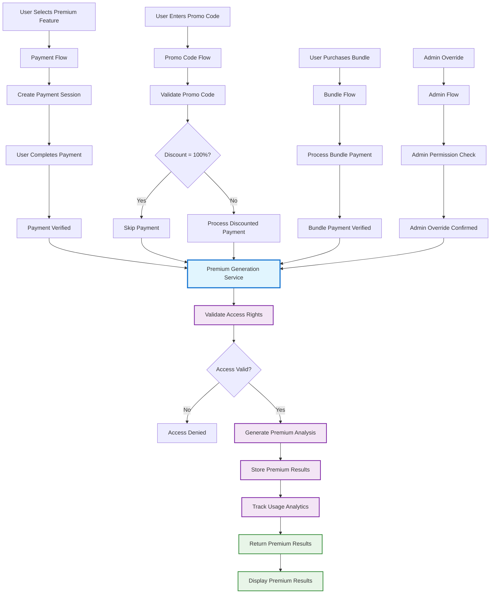
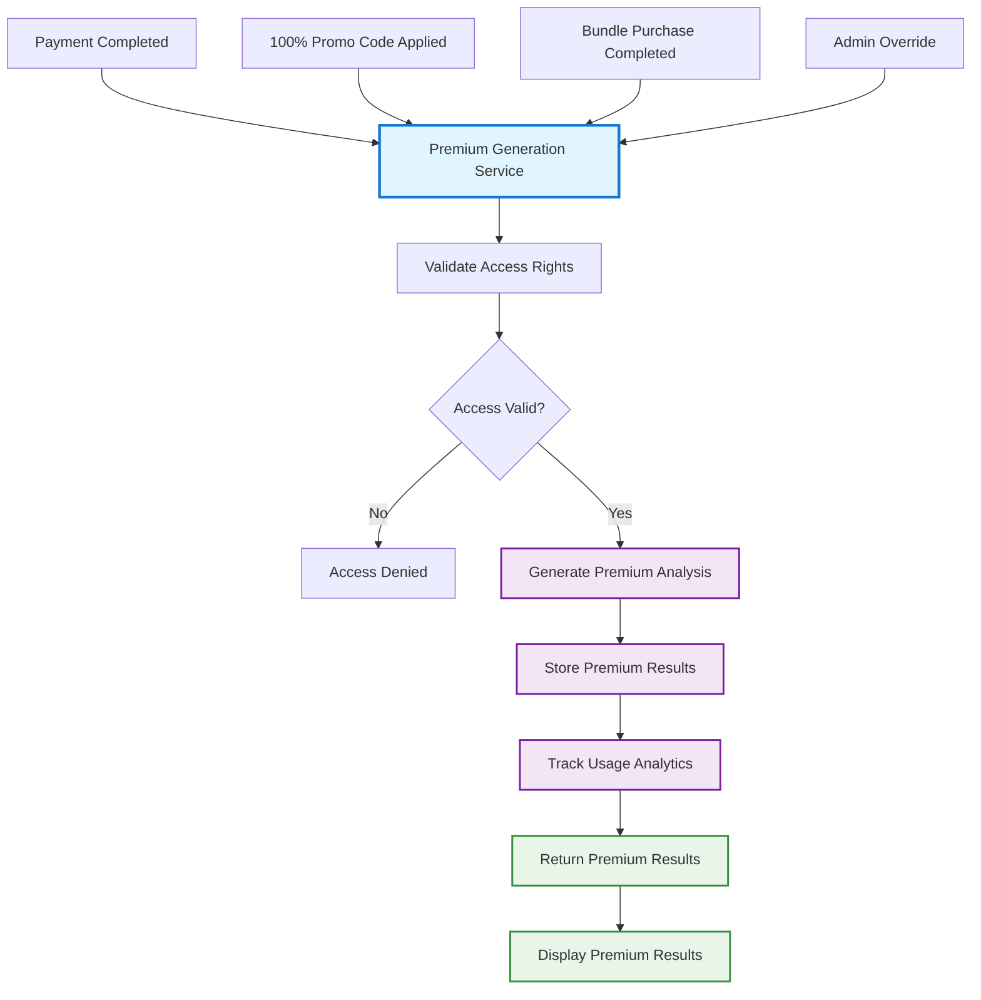
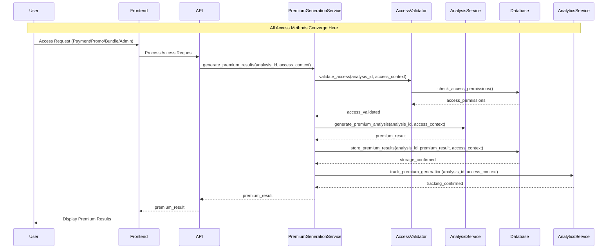
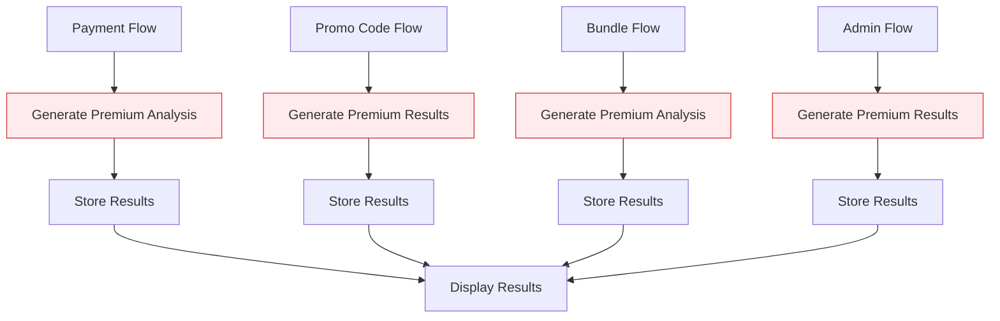
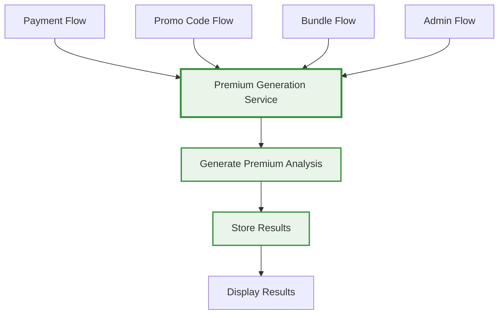

# 🔄 **Unified Premium Generation Flow**

## 🎯 **Overview**

This diagram shows how all different access methods (payment, promotional codes, bundles, admin override) converge to a single, unified Premium Generation Service, eliminating code duplication and ensuring consistency.

---

## 🔄 **Unified Flow Diagram**



---

## 🔄 **Simplified Flow Diagram**



---

## 🔄 **Sequence Diagram - Unified Service**



---

## 🎯 **Key Benefits Visualized**

### **Before (Duplicated Logic)**


### **After (Unified Logic)**


---

## 📊 **Access Context Examples**

### **Payment Access Context**
```json
{
  "access_type": "payment",
  "payment_id": "pay_1234567890",
  "metadata": {
    "stripe_session_id": "cs_1234567890",
    "amount": 2500,
    "currency": "usd"
  }
}
```

### **Promo Code Access Context**
```json
{
  "access_type": "promo_code",
  "promo_code": "FREEPREMIUM2025",
  "metadata": {
    "discount_value": 100,
    "discount_type": "percentage"
  }
}
```

### **Bundle Access Context**
```json
{
  "access_type": "bundle",
  "bundle_id": "bundle_1234567890",
  "metadata": {
    "bundle_type": "career_boost",
    "included_analyses": ["analysis_1", "analysis_2"]
  }
}
```

### **Admin Access Context**
```json
{
  "access_type": "admin_override",
  "admin_user": "admin@company.com",
  "metadata": {
    "override_reason": "customer_support",
    "admin_permissions": ["premium_override"]
  }
}
```

---

## 🔗 **Related Documentation**
- **Architecture**: [Unified Premium Generation Architecture](../architecture/UNIFIED_PREMIUM_GENERATION.md)
- **Implementation**: [Unified Premium Implementation Plan](../implementation/UNIFIED_PREMIUM_IMPLEMENTATION.md)
- **Critical Fix**: [Critical Architecture Fix](../CRITICAL_ARCHITECTURE_FIX.md)
