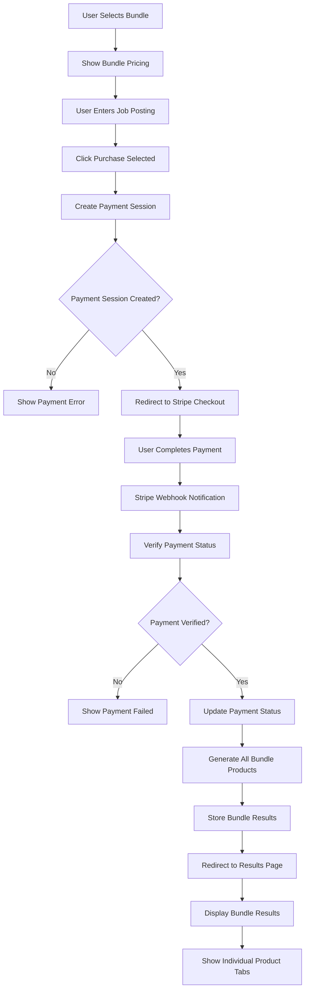

# 📦 **Bundle Products Feature**

## 🎯 **Feature Overview**
**Story ID**: STORY-004  
**Title**: Bundle Product Offerings  
**Epic**: Payment System  
**Status**: In Progress  

---

## 📝 **User Story**
**As a**: Cost-conscious user  
**I want**: To purchase multiple products at a discounted bundle price  
**So that**: I can get comprehensive resume help at a better value  

---

## ✅ **Acceptance Criteria**
- [ ] System offers 3 bundle options:
  - Career Boost Bundle ($18): Resume Analysis + Job Fit Analysis
  - Job Hunter Bundle ($15): Resume Analysis + Cover Letter
  - Complete Package ($22): All 4 products
- [ ] System shows bundle savings compared to individual prices
- [ ] User can select bundle option
- [ ] System processes bundle payment
- [ ] System generates all products included in bundle
- [ ] System displays all bundle results with tabbed interface
- [ ] System allows access to all bundle products after payment
- [ ] System handles partial bundle generation failures

---

## 🔄 **Flow Diagram**

---

## 🧪 **Test Cases**
- **Unit Tests**: Bundle product generation, pricing calculation
- **Integration Tests**: Complete bundle purchase flow
- **Error Tests**: Partial bundle generation failures
- **Security Tests**: Bundle payment validation

---

## 📊 **Non-Functional Requirements**
- **Performance**: Bundle generation within 60 seconds
- **Security**: Secure bundle payment processing
- **Usability**: Clear bundle comparison, easy selection
- **Reliability**: 99.9% bundle delivery success
- **Scalability**: Handle bundle complexity efficiently

---

## 🔗 **Related Documentation**
- **Implementation**: [Sprint 2 Plan](../sprints/sprint-2.md)
- **Tests**: [Bundle Tests](../tests/bundle-tests.md)
- **Bugs**: [Bundle Delivery Bug](../bugs/bundle-delivery-bug.md)
- **API**: [Bundle API](../api/bundle-endpoints.md)
