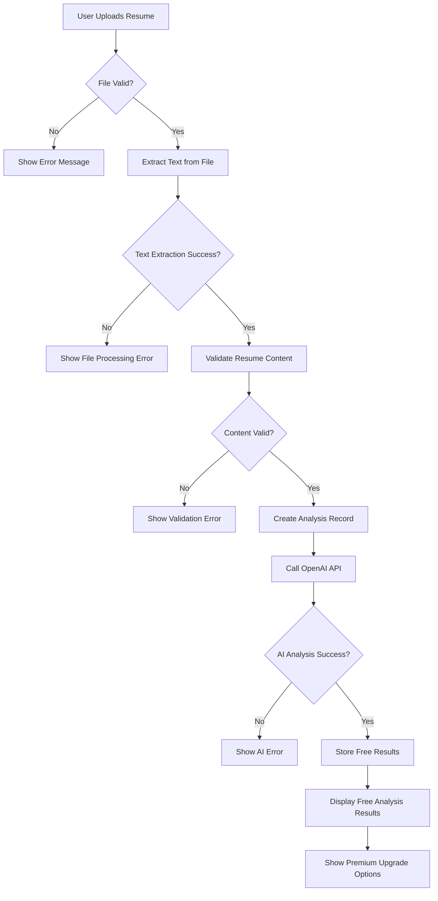
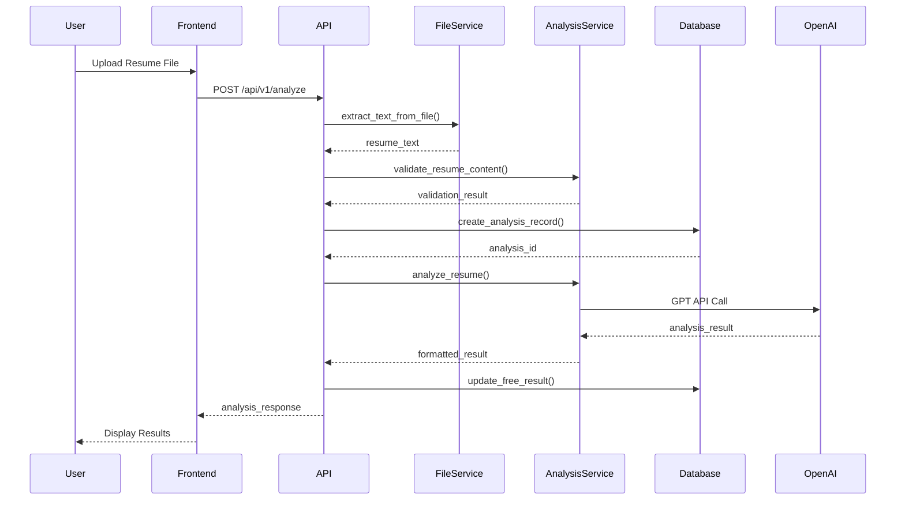
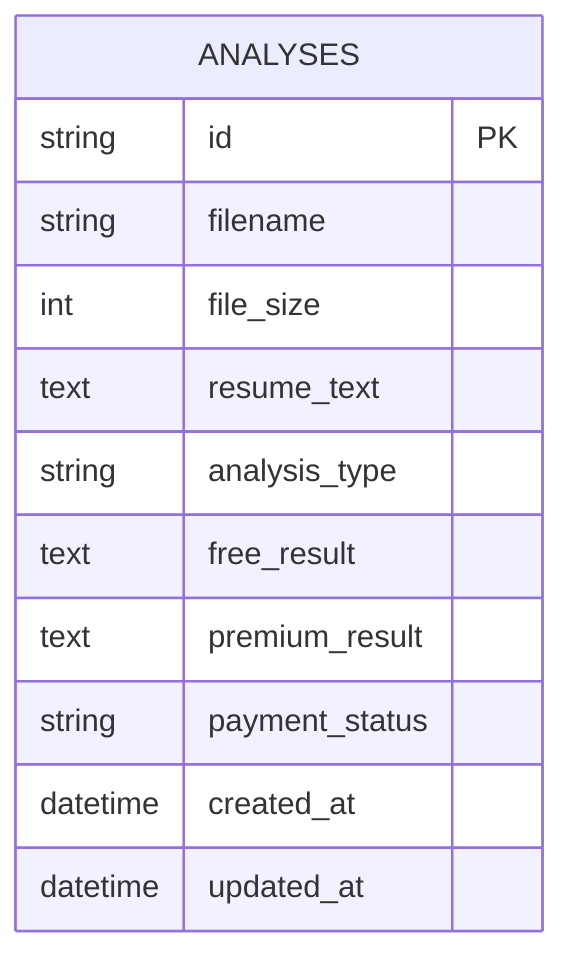

# 📋 **Free Resume Analysis Feature**

## 🎯 **Feature Overview**
**Story ID**: STORY-001  
**Title**: Free Resume Analysis for Basic Feedback  
**Epic**: Core Resume Analysis  
**Status**: Done  

---

## 📝 **User Story**
**As a**: Job seeker  
**I want**: To upload my resume and get free basic analysis  
**So that**: I can understand my resume's strengths and weaknesses without paying  

---

## ✅ **Acceptance Criteria**
- [ ] User can upload PDF, DOCX, or TXT resume files
- [ ] System validates file format and size (max 5MB)
- [ ] System extracts text from uploaded file
- [ ] System validates resume content (not empty, reasonable length)
- [ ] System calls OpenAI API for analysis
- [ ] System stores analysis results in database
- [ ] System displays free analysis results to user
- [ ] System shows premium upgrade options after free analysis
- [ ] System handles file processing errors gracefully
- [ ] System handles OpenAI API failures gracefully

---

## 🔄 **Flow Diagram**

---

## 🔄 **Sequence Diagram**

---

## 🗄️ **Database Schema**

---

## 🧪 **Test Cases**
- **Unit Tests**: File extraction, content validation, AI analysis
- **Integration Tests**: Complete analysis flow
- **Error Tests**: File processing failures, AI API failures
- **Security Tests**: File upload validation, input sanitization

---

## 📊 **Non-Functional Requirements**
- **Performance**: Analysis completion within 30 seconds
- **Security**: File upload validation, no malicious file processing
- **Usability**: Drag-and-drop file upload, clear progress indicators
- **Reliability**: 99.9% uptime, graceful error handling
- **Scalability**: Handle 100 concurrent uploads

---

## 🔗 **Related Documentation**
- **Implementation**: [Sprint 1 Plan](../sprints/sprint-1.md)
- **Tests**: [Test Coverage](../tests/unit-tests.md)
- **Bugs**: [File Upload Bugs](../bugs/file-upload-bugs.md)
- **API**: [Analysis API](../api/analysis-endpoints.md)
