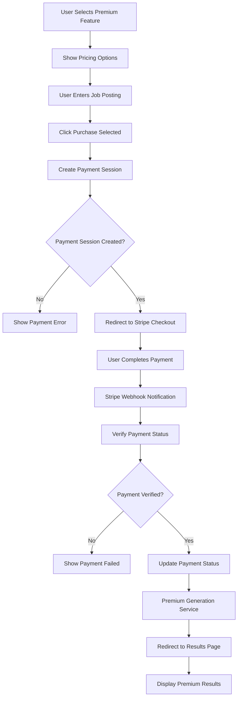
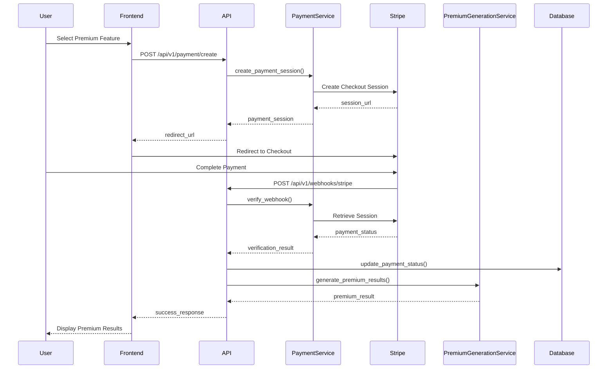
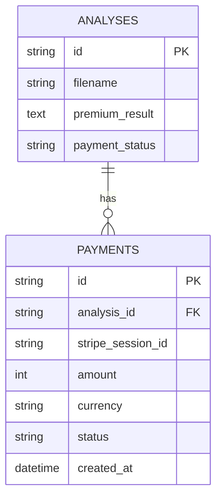

# 💳 **Premium Payment & Results Feature**

## 🎯 **Feature Overview**
**Story ID**: STORY-002  
**Title**: Premium Resume Analysis with Detailed Insights  
**Epic**: Payment System  
**Status**: Done  

---

## 📝 **User Story**
**As a**: Job seeker  
**I want**: To purchase premium analysis for detailed insights  
**So that**: I can get comprehensive feedback to improve my resume  

---

## ✅ **Acceptance Criteria**
- [ ] User can select premium analysis option
- [ ] System shows pricing based on user's region
- [ ] User can enter job posting for job-specific analysis
- [ ] System creates Stripe payment session
- [ ] User completes payment via Stripe Checkout
- [ ] System verifies payment via webhook
- [ ] System generates premium analysis with detailed insights
- [ ] System stores premium results in database
- [ ] System displays premium results to user
- [ ] System allows access to premium results after payment

---

## 🔄 **Flow Diagram**

---

## 🔄 **Sequence Diagram**

---

## 🗄️ **Database Schema**

---

## 🧪 **Test Cases**
- **Unit Tests**: Payment session creation, webhook verification
- **Integration Tests**: Complete payment flow
- **Error Tests**: Payment failures, webhook failures
- **Security Tests**: Payment validation, webhook security

---

## 📊 **Non-Functional Requirements**
- **Performance**: Payment processing within 10 seconds
- **Security**: Secure payment handling, PCI compliance
- **Usability**: Clear pricing display, smooth payment flow
- **Reliability**: 99.9% payment success rate
- **Scalability**: Handle 50 concurrent payments

---

## 🔗 **Related Documentation**
- **Implementation**: [Sprint 1 Plan](../sprints/sprint-1.md)
- **Tests**: [Payment Tests](../tests/payment-tests.md)
- **Bugs**: [Payment Bugs](../bugs/payment-bugs.md)
- **API**: [Payment API](../api/payment-endpoints.md)
