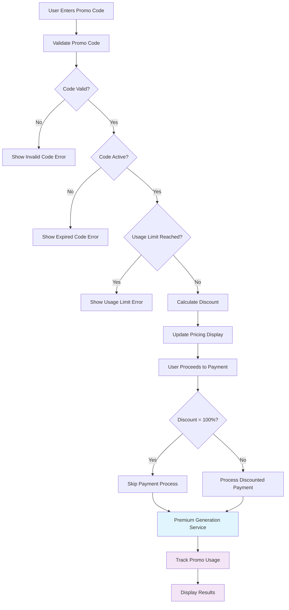
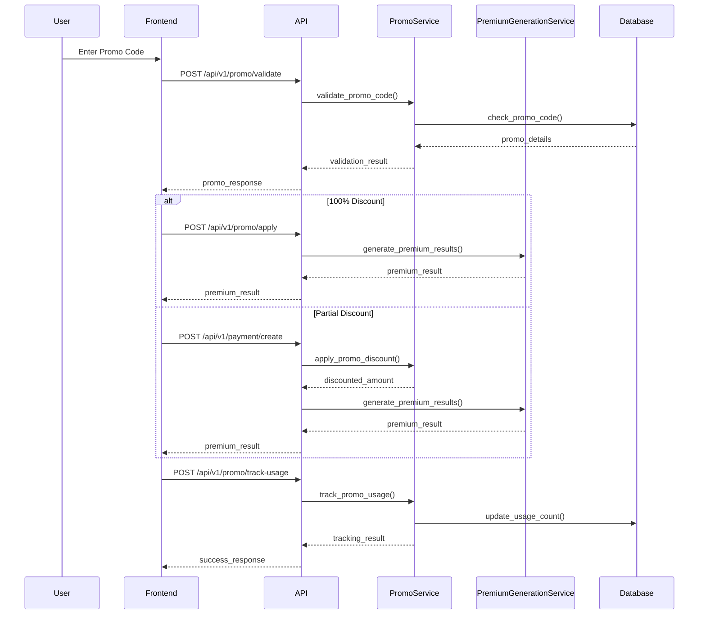
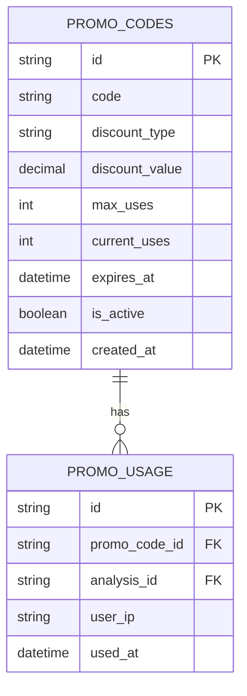

# 🎯 **Promotional Codes Feature**

## 🎯 **Feature Overview**
**Story ID**: STORY-005, STORY-006, STORY-007  
**Title**: Promotional Code System  
**Epic**: Promotional System  
**Status**: To Do  

---

## 📝 **User Stories**

### **STORY-005: Promotional Code Entry**
**As a**: User with a promotional code  
**I want**: To enter my promotional code to get a discount  
**So that**: I can access premium features at a reduced price  

### **STORY-006: Promotional Code Application**
**As a**: User with valid promotional code  
**I want**: To apply my promotional discount to my payment  
**So that**: I can pay the discounted amount  

### **STORY-007: Promotional Code Analytics**
**As a**: Product Owner  
**I want**: To track promotional code usage and performance  
**So that**: I can measure campaign effectiveness and optimize promotions  

---

## ✅ **Acceptance Criteria**

### **Code Entry & Validation**
- [ ] User can enter promotional code in input field
- [ ] System validates promotional code format
- [ ] System checks if code exists and is active
- [ ] System verifies code hasn't expired
- [ ] System checks usage limits (max uses per code)
- [ ] System calculates discount amount (percentage or fixed)
- [ ] System updates pricing display with discount
- [ ] System shows original price, discount, and final price
- [ ] System handles invalid/expired codes gracefully
- [ ] System prevents code reuse by same user

### **Discount Application**
- [ ] System applies discount to selected product/bundle
- [ ] System calculates discounted amount correctly
- [ ] System updates Stripe payment session with discounted amount
- [ ] System handles 100% discount (free access)
- [ ] System tracks promotional code usage
- [ ] System prevents multiple uses of same code by same user
- [ ] System logs promotional code usage for analytics
- [ ] System handles discount calculation errors gracefully
- [ ] System validates discount doesn't exceed product price
- [ ] System shows clear discount breakdown

### **Analytics & Tracking**
- [ ] System tracks each promotional code usage
- [ ] System records user IP, timestamp, and product purchased
- [ ] System tracks conversion rates by promotional code
- [ ] System tracks revenue impact of promotional codes
- [ ] System provides analytics dashboard for promotional codes
- [ ] System shows usage statistics (total uses, unique users)
- [ ] System tracks geographic distribution of code usage
- [ ] System monitors code performance over time
- [ ] System alerts when codes reach usage limits
- [ ] System provides export functionality for analytics data

---

## 🔄 **Flow Diagram**

---

## 🔄 **Sequence Diagram**

---

## 🗄️ **Database Schema**

---

## 🧪 **Test Cases**
- **Unit Tests**: Code validation, discount calculation, usage tracking
- **Integration Tests**: Complete promotional flow
- **Error Tests**: Invalid codes, expired codes, usage limits
- **Security Tests**: Code validation, usage tracking security

---

## 📊 **Non-Functional Requirements**
- **Performance**: Code validation within 1 second
- **Security**: Secure code validation, prevent code guessing
- **Usability**: Clear discount display, easy code entry
- **Reliability**: 99.9% code validation accuracy
- **Scalability**: Handle high code validation volume

---

## 🔗 **Related Documentation**
- **Implementation**: [Sprint 3 Plan](../sprints/sprint-3.md)
- **Tests**: [Promotional Tests](../tests/promotional-tests.md)
- **Bugs**: [Promotional Bugs](../bugs/promotional-bugs.md)
- **API**: [Promotional API](../api/promotional-endpoints.md)
