# 📊 **Resume Health Checker v4.0 - Complete Flow Documentation**

## 🎯 **Flow Overview**

This document provides comprehensive documentation for all user flows in the Resume Health Checker application, including:
- Flow Diagrams
- Sequence Diagrams  
- Schema Diagrams
- Architectural Diagrams
- Test Coverage Requirements

---

## 🔄 **Flow 1: Free Resume Analysis**

### **Flow Diagram**
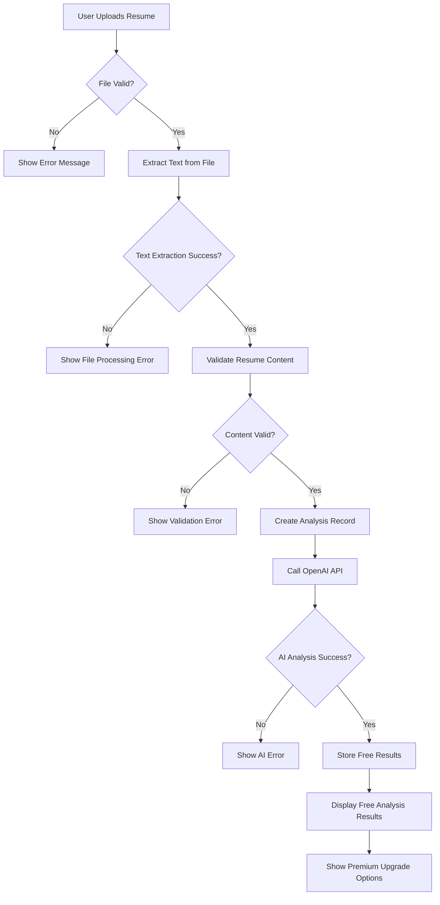

### **Sequence Diagram**
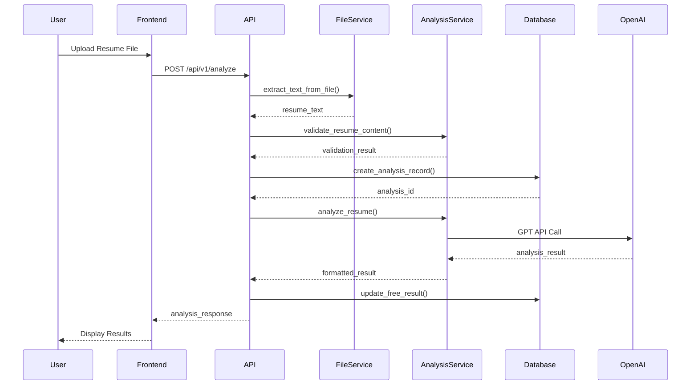

### **Schema Diagram**
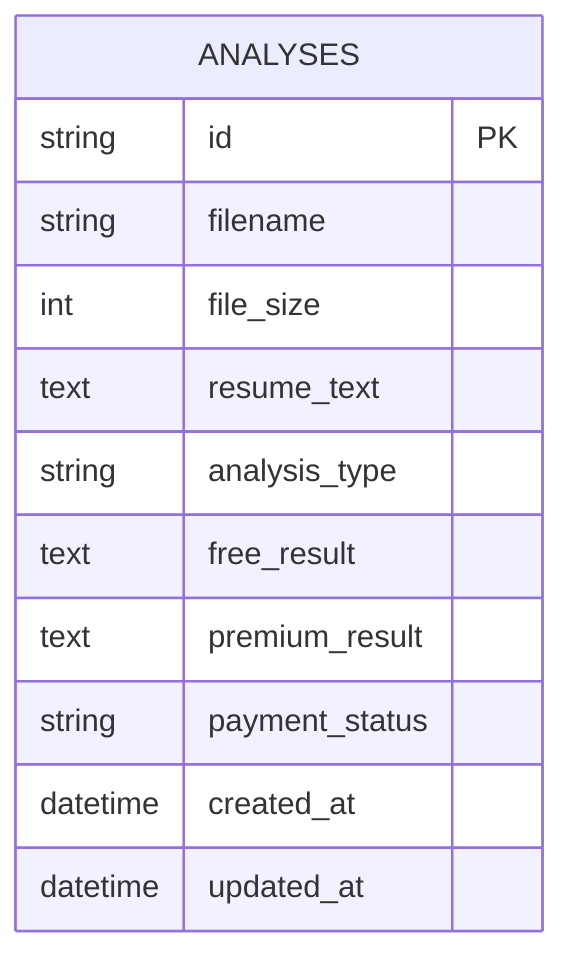

### **Architectural Diagram**
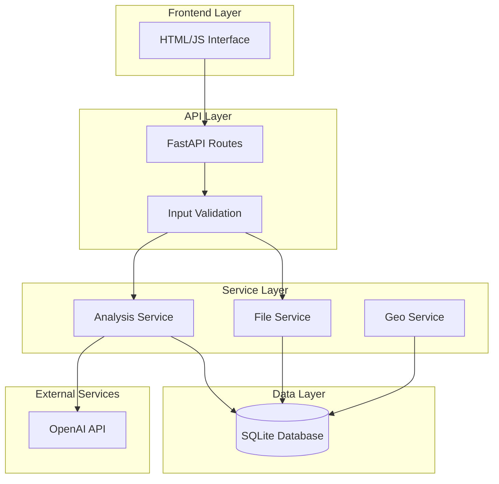

### **Test Coverage Requirements**
```python
# test_free_analysis_success.py
def test_free_analysis_success():
    """Test successful free analysis flow"""
    pass

def test_free_analysis_invalid_file():
    """Test analysis with invalid file format"""
    pass

def test_free_analysis_empty_content():
    """Test analysis with empty resume content"""
    pass

def test_free_analysis_ai_failure():
    """Test analysis when OpenAI API fails"""
    pass

def test_free_analysis_database_error():
    """Test analysis when database operations fail"""
    pass
```

---

## 💳 **Flow 2: Premium Payment & Results**

### **Flow Diagram**
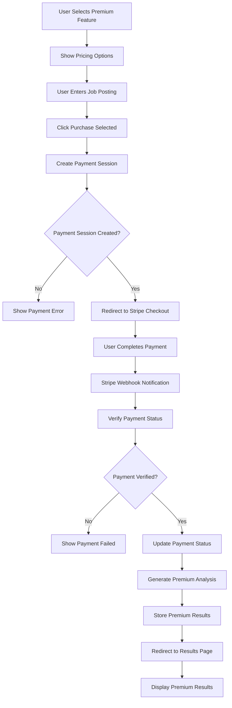

### **Sequence Diagram**
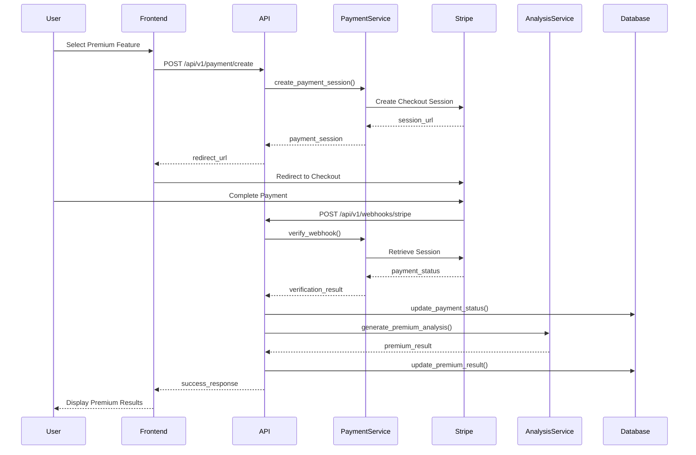

### **Schema Diagram**
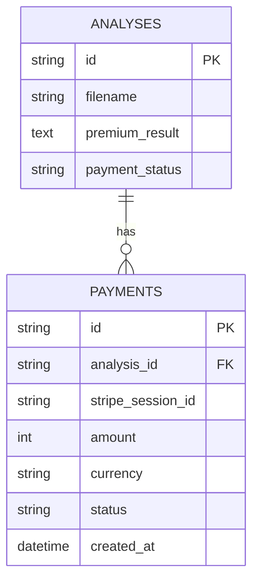

### **Test Coverage Requirements**
```python
# test_premium_payment_success.py
def test_premium_payment_success():
    """Test successful premium payment flow"""
    pass

def test_premium_payment_session_creation():
    """Test payment session creation"""
    pass

def test_premium_payment_webhook_verification():
    """Test Stripe webhook verification"""
    pass

def test_premium_payment_failed():
    """Test failed payment handling"""
    pass

def test_premium_payment_duplicate():
    """Test duplicate payment prevention"""
    pass
```

---

## 📦 **Flow 3: Bundle Purchase & Delivery**

### **Flow Diagram**
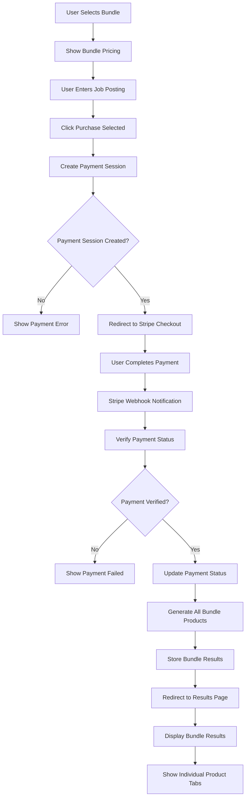

### **Sequence Diagram**
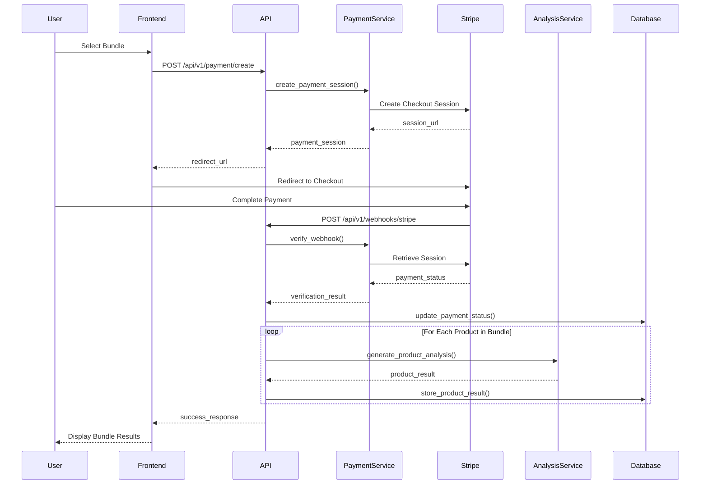

### **Test Coverage Requirements**
```python
# test_bundle_purchase_success.py
def test_bundle_purchase_success():
    """Test successful bundle purchase flow"""
    pass

def test_bundle_all_products_generated():
    """Test all bundle products are generated"""
    pass

def test_bundle_results_display():
    """Test bundle results display with tabs"""
    pass

def test_bundle_pricing_calculation():
    """Test bundle pricing calculation"""
    pass

def test_bundle_partial_failure():
    """Test bundle when some products fail"""
    pass
```

---

## 🎯 **Flow 4: Promotional Code Application**

### **Flow Diagram**
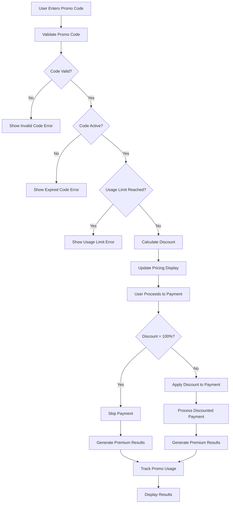

### **Sequence Diagram**
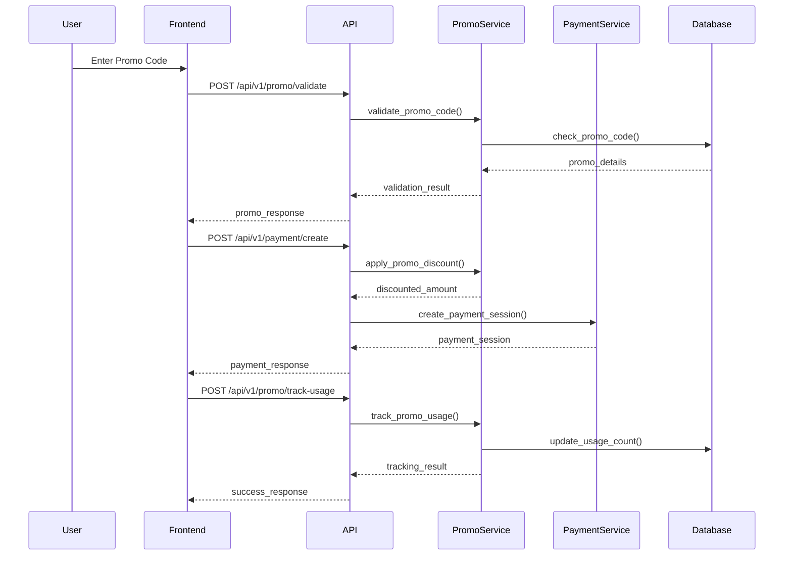

### **Schema Diagram**
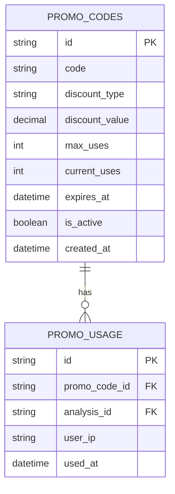

### **Test Coverage Requirements**
```python
# test_promo_code_validation.py
def test_promo_code_valid():
    """Test valid promo code validation"""
    pass

def test_promo_code_invalid():
    """Test invalid promo code validation"""
    pass

def test_promo_code_expired():
    """Test expired promo code validation"""
    pass

def test_promo_code_usage_limit():
    """Test promo code usage limit"""
    pass

def test_promo_code_100_percent_discount():
    """Test 100% discount promo code"""
    pass
```

---

## 📊 **Flow 5: Export & Download**

### **Flow Diagram**
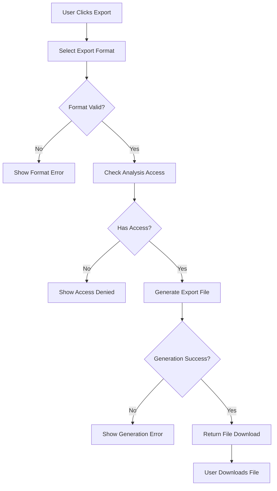

### **Sequence Diagram**
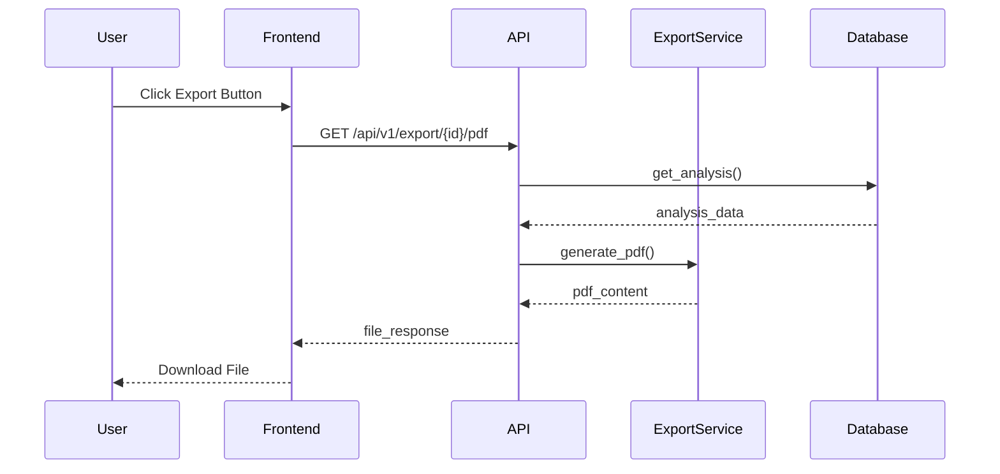

### **Test Coverage Requirements**
```python
# test_export_functionality.py
def test_export_pdf_success():
    """Test successful PDF export"""
    pass

def test_export_docx_success():
    """Test successful DOCX export"""
    pass

def test_export_access_denied():
    """Test export without proper access"""
    pass

def test_export_invalid_format():
    """Test export with invalid format"""
    pass
```

---

## 🔧 **Flow 6: Admin & Debug**

### **Flow Diagram**
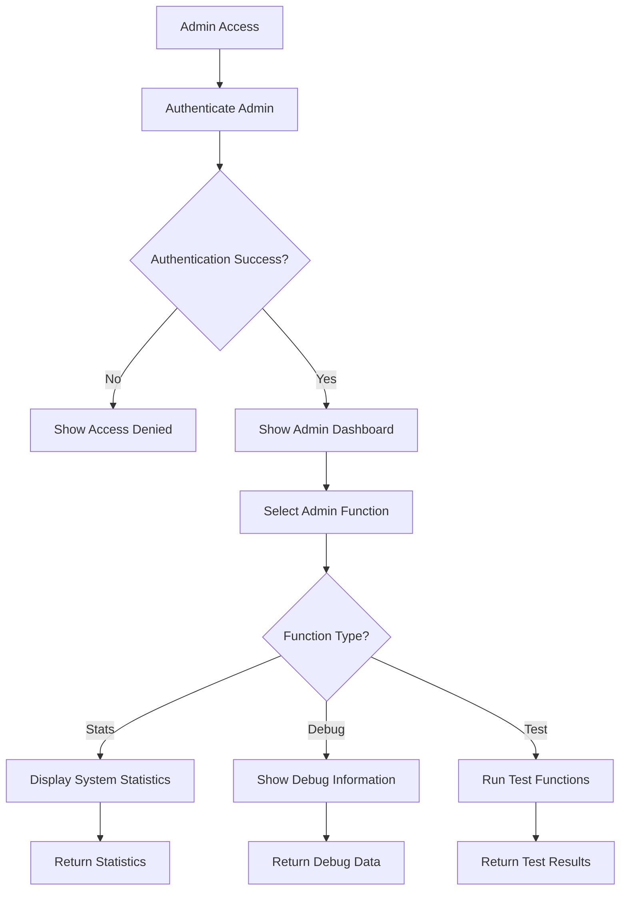

### **Test Coverage Requirements**
```python
# test_admin_functionality.py
def test_admin_authentication():
    """Test admin authentication"""
    pass

def test_admin_stats_access():
    """Test admin statistics access"""
    pass

def test_admin_debug_access():
    """Test admin debug access"""
    pass

def test_admin_unauthorized_access():
    """Test unauthorized admin access"""
    pass
```

---

## 🧪 **Test Coverage Matrix**

| Flow | Unit Tests | Integration Tests | E2E Tests | Security Tests |
|------|------------|-------------------|-----------|----------------|
| Free Analysis | ✅ | ✅ | ✅ | ✅ |
| Premium Payment | ✅ | ✅ | ✅ | ✅ |
| Bundle Purchase | ✅ | ✅ | ✅ | ✅ |
| Promo Code | ✅ | ✅ | ✅ | ✅ |
| Export | ✅ | ✅ | ✅ | ✅ |
| Admin | ✅ | ✅ | ✅ | ✅ |

---

## 📋 **Implementation Checklist**

### **For Each Flow:**
- [ ] Flow diagram created
- [ ] Sequence diagram created
- [ ] Schema diagram created (if applicable)
- [ ] Architectural diagram created
- [ ] Unit tests written (100% coverage)
- [ ] Integration tests written
- [ ] E2E tests written
- [ ] Security tests written
- [ ] Error handling implemented
- [ ] Input validation implemented
- [ ] Documentation updated

### **Quality Gates:**
- [ ] All tests pass
- [ ] Code coverage = 100%
- [ ] Security scan passes
- [ ] Performance tests pass
- [ ] Documentation complete

---

**This document will be updated as new flows are added or existing flows are modified.**
